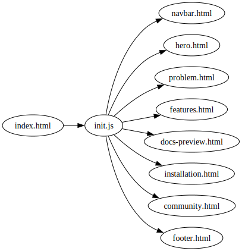
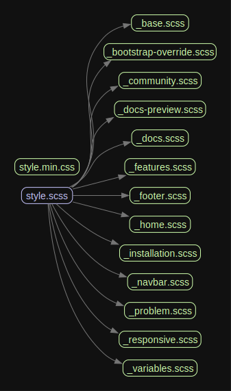

<p align="center">

</p>

> **Fluent API Documentation for Hono**  
> Build OpenAPI documentation in Hono without complicated pipelines. Import, use, and your docs are automatically available.

---

## Tentang Website Ini

Website ini merupakan **company profile bertema dokumentasi** untuk **Fluenth** — sebuah developer tools company yang menyediakan solusi API documentation yang fluent dan type-safe untuk Hono framework.

Meskipun disajikan dalam format dokumentasi teknis, website ini memenuhi ketentuan **"company profile"** karena menampilkan seluruh informasi profil perusahaan secara jelas:

| Informasi Perusahaan           | Section yang Menampilkan |
| ------------------------------ | ------------------------ |
| Nama & identitas brand         | Hero, Footer             |
| Visi & misi (solve pain point) | Problem Section          |
| Produk & fitur                 | Features Section         |
| Cara menggunakan produk        | Installation Section     |
| Dokumentasi produk             | Documentation Preview    |
| Komunitas & support            | Community Section        |
| Kontak & social links          | Footer, Community Cards  |
| Lisensi & open-source info     | Footer                   |

---

## Arsitektur

Project ini bertransisi dari **monolith** ke **modular** seiring growth halaman utama.

### Monolith → Modular

| Pendekatan             | File                           | Baris       | Cara Kerja                         |
| ---------------------- | ------------------------------ | ----------- | ---------------------------------- |
| **Monolith** (legacy)  | `monolith/index-monolith.html` | ~698        | Semua section dalam satu file HTML |
| **Modular** (sekarang) | `index.html` + `parts/*.html`  | ~46 (shell) | Partial di-load via `fetch()`      |

---

### Modular

`index.html` hanya berisi placeholder:

```html
<div id="navbar"></div>
<div id="hero"></div>
<div id="problem"></div>
<!-- ... -->
<div id="footer"></div>
<script src="script/include.js"></script>
```

`script/include.js` membaca tiap partial dan menyuntikkan ke DOM:

```js
async function loadComponent(id, file) {
  const el = document.getElementById(id);
  const res = await fetch(file);
  el.innerHTML = await res.text();
}
loadComponent("navbar", "parts/navbar.html");
loadComponent("hero", "parts/hero.html");
// ...
```

Keuntungan:

- Setiap section bisa diedit lebih mudah karena file file nya kecil

> **Catatan:** `monolith/` tetap dipertahankan sebagai arsip/cadangan. Semua pengembangan baru dilakukan di `index.html` + `parts/`.



**SCSS Modular:**

Kenapa SCSS partials?
Saya sadar diri saya tidak jago styling — kalau semua CSS ditulis dalam satu file, udah mah css debug nya susah , ketambah skill issue 🫨.



<h2>Screenshots</h2>

<h3>Home</h3>


<h3>Docs</h3>


<h3>Installation</h3>


---

## Referensi Desain

Website ini dikembangkan dengan mempelajari dan mengadaptasi pola desain dari:

### 1. Scalar (<https://scalar.com/>)

**Yang diadopsi:**

- Dokumentasi sebagai company profile (homepage = introduction, products = showcase)
- Code snippets

**Yang dimodifikasi:**

- Warna accent: Scalar purple/pink → Catppuccin Macchiato palette (cyan, mauve, green)
- Konten: Scalar platform → Fluenth specific tool untuk Hono framework
- Tambah fitur: Theme toggle dengan localStorage persistence
- Personalisasi: Fokus pada pain point Hono + Zod OpenAPI pipeline

### 2. Hono.dev (<https://hono.dev/>)

**Yang diadopsi:**

- Minimalist documentation layout dengan fokus pada code examples
- Penggunaan monospace/Maple Mono NF font untuk kode + sans-serif untuk UI

**Yang dimodifikasi:**

- Expand dari docs-only → company profile structure (8 sections)
- Tambah interactive elements: terminal mock, flow diagram, feature cards
- Tambah section Problem dengan before/after code comparison

---

## Struktur Section (8 Sections)

Website ini memiliki **8 section utama** yang memenuhi ketentuan minimal:

| No  | Section ID              | Judul                 | Konten Utama                                                            |
| --- | ----------------------- | --------------------- | ----------------------------------------------------------------------- |
| 1   | `hero`                  | Home / Introduction   | Hero headline, tagline, CTA buttons, code preview                       |
| 2   | `problem`               | The Problem           | Before/after flow diagram, code comparison (verbose vs fluent)          |
| 3   | `features`              | Features              | 8 feature cards dengan ikon + deskripsi singkat                         |
| 4   | `documentation-preview` | Documentation Preview | Mock Scalar UI preview dengan endpoint list + parameter table           |
| 5   | `installation`          | Installation          | Terminal mock (npm/pnpm/bun), usage code snippet                        |
| 6   | `community`             | Community             | GitHub, Discord, Twitter cards dengan link eksternal                    |
| 7   | `footer`                | Footer Navigation     | Documentation links, Reference links, Community links, copyright        |
| 8   | _(implicit)_            | About / Company Info  | Brand statement di footer: "The documentation-first companion for Hono" |

---
